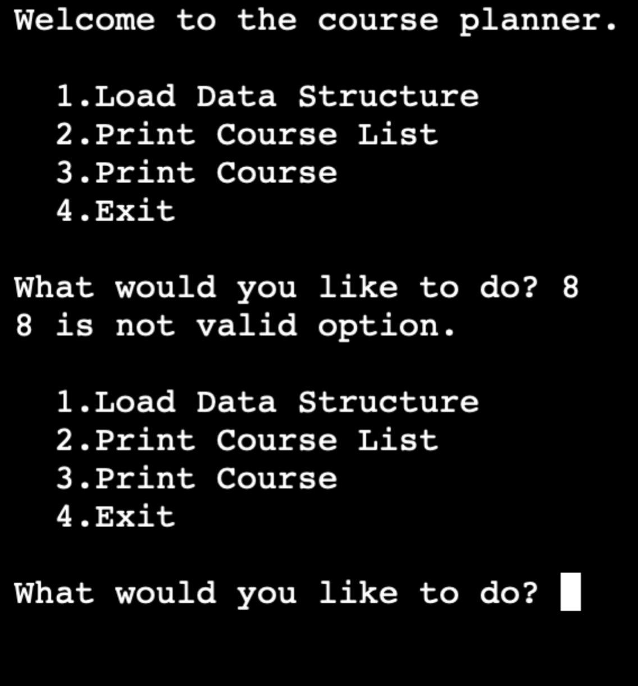
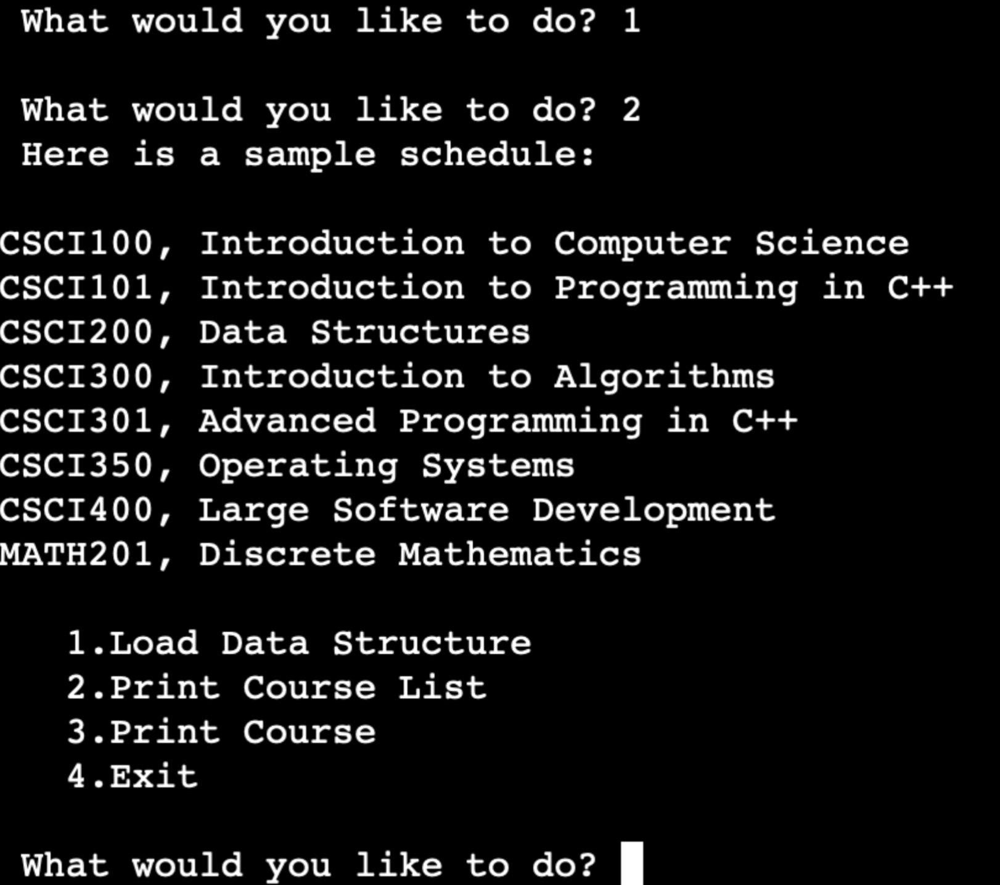
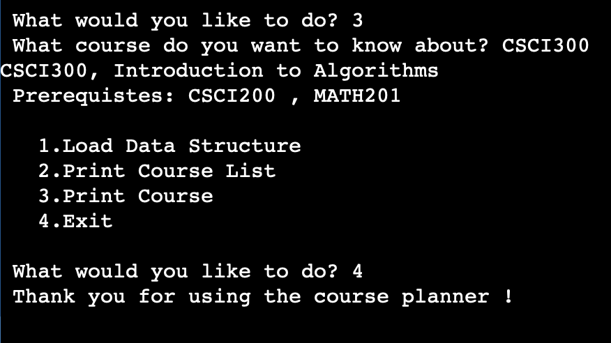

# Data-Structures-Algorithms-CS300Project
Assignment for CS300 at SNHU in Data Structures and Algorithms 

    
<h3> What was the problem you were solving in the projects for this course? </h3>
  
The problem I was solving in this project for this course was to use algorithms and data structures that would read the course data file and then load the data from the file into the data structure. Once the data was loaded into the data structure, I had to sort and print out a list of the courses in the Computer Science program in alphanumeric order. Finally on the last image from above, I had to develope working code to print the course information inlcuidng the prerequistes for that specific course.  

<h3> How did you approach the problem? Consider why data structures are important to understand. </h3>
  
During this course, we started to develop the pseudocode for this assignmnet. Doing the pseudocode first, helped me undertand the project better and knew what I had to program to make this project work. Data Structures are very important to understand since it gives us a structure to organize and store our data and eventually applying algorithms to solve the problem. 

<h3> How did you overcome any roadblocks you encountered while going through the activities or project? </h3>   
Looking at the earlier assignmnets and zybooks examples from this course helped a lot with this assignmnets. I was also foud Stack Overflow and geeksforgeeks.org very useful when I had to overcome roadblocks. 

<h3> How has your work on this project expanded your approach to designing software and developing programs? </h3>

<h3> How has your work on this project evolved the way you write programs that are maintainable, readable, and adaptable? </h3>

